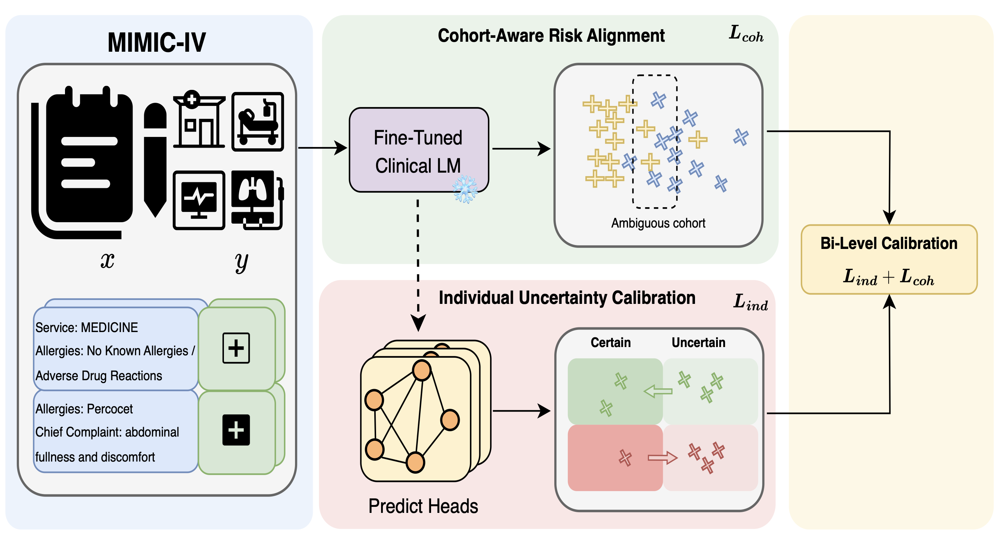

# CURA: Clinical Uncertainty Risk Alignment for Language Model-Based Risk Prediction

<p align="center">
  
</p>

Overview of the CURA pipeline. The clinical language model is fine-tuned on MIMIC-IV notes to produce task-adapted embeddings for a multi-head classifier, trained with a base loss L_base plus a bi-level uncertainty calibration: the individual term L_ind calibrates patient-level uncertainty, and the cohort-aware term L_coh aligns predictions with neighborhood risks in the embedding space, emphasizing ambiguous cohorts.

## Code Structure

This repository implements the two-stage CURA framework as described in the paper.

**Stage 1: Clinical LM Fine-Tuning**  
The first stage fine-tunes a clinical language model on downstream prediction tasks to extract task-adapted patient embeddings.
- `run_stage1.sh` -> `stage1_cv_train.py`: Main scripts for Stage 1 fine-tuning and extracting frozen embeddings.
- `run_stage1_repr_uncert.sh` -> `stage1_compute_repr_uncert.py`: Computes local neighborhood statistics (q(x) and H_hat(q)) on the frozen embeddings, which are required for the cohort-aware risk alignment in Stage 2.

**Stage 2: Uncertainty Fine-Tuning**  
The second stage trains a multi-head classifier on the frozen embeddings from Stage 1 using the bi-level uncertainty objective (L_base + L_ind + L_coh).
- `run_stage2.sh` -> `stage2_train_from_embeddings.py`: Main scripts for Stage 2 uncertainty fine-tuning. Evaluation metrics (AUROC, AUPRC, ECE, etc.) are computed and saved automatically at the end of training.

Configuration for each stage is managed via parameter files located in the `params/` directory.

## Environment Setup

Recommended environment:

- Python >= 3.9
- PyTorch >= 2.0
- Transformers >= 4.30
- scikit-learn
- pandas
- numpy
- wandb (optional)

Install dependencies with:

```bash
pip install torch transformers scikit-learn pandas numpy wandb
```

## Data

This project uses clinical notes from the **MIMIC-IV** and **MIMIC-IV-Note** databases. Access must be obtained through [PhysioNet](https://physionet.org/).

After obtaining access and processing the clinical notes, the input data format is a CSV file containing the text column `clean_text` and binary labels for the following 5 clinical risk prediction tasks:

- `death_in_7`: 7-day mortality
- `death_in_30`: 30-day mortality
- `Discharge`: early discharge
- `Hospital`: in-hospital mortality
- `after_ICU_more_than_3_days`: ICU stay > 1 day

Data files are **not** distributed in this repository to comply with the PhysioNet data use agreement.

## How To Run

All parameter files in `params/` are intentionally shipped with blank values. Fill in the paths and experiment settings before running the scripts.

### 1. Stage 1: Clinical LM Fine-Tuning

Edit the Stage 1 parameter file `params/Stage1_params.sh`. The `TARGET_LABELS` field accepts one or more task labels separated by spaces; Stage 1 will run a separate fine-tuning experiment for each label in sequence and write outputs to independent directories.

```bash
# Single task
TARGET_LABELS="death_in_30"

# Multiple tasks (Stage 1 loops over each; outputs are stored per label)
TARGET_LABELS="death_in_30 death_in_7"
```

Then launch Stage 1:

```bash
bash run_stage1.sh params/Stage1_params.sh
```

### 2. Representation Uncertainty on Stage 1 Embeddings

If you plan to use cohort-aware Stage 2 training, fill in `params/Stage1_repr_uncert_params.sh` and run:

```bash
bash run_stage1_repr_uncert.sh params/Stage1_repr_uncert_params.sh
```

### 3. Stage 2: Uncertainty Fine-Tuning

Fill in `params/Stage2_params.sh`, then run:

```bash
bash run_stage2.sh params/Stage2_params.sh
```

> **Alternative / re-run without Stage 1**: `params/Stage2_params.sh` is independent of the Stage 1 parameter files. Because Stage 1 (LM fine-tuning) is computationally expensive, Stage 2 can be re-run with different hyperparameters on already-computed Stage 1 embeddings simply by editing `EMBEDDINGS_ROOT` and the relevant Stage 2 settings in `Stage2_params.sh`, without rerunning Stage 1.

## Output Layout

Stage 2 outputs are organized under the Stage 1 label directory:

```text
{Stage1_label_dir}/Stage2/{experiment_name}/
├── checkpoint/
│   ├── fold_1/
│   ├── fold_2/
│   └── ...
└── evaluate/
    ├── fold_1_val.json
    ├── fold_1_test.json
    ├── fold_1_test_predictions.npz
    ├── val_summary.json
    └── test_summary.json
```

## Citation

If you use this repository in your research, please cite:

```bibtex
@article{wang2025cura,
  title={CURA: Clinical Uncertainty \& Risk Alignment for Language Model Based Risk Prediction},
  author={Wang, Sizhe and Huang, Jiaxin},
  year={2025}
}
```

## License

This repository is intended for research use. Please ensure that all use of clinical data complies with the MIMIC-IV and MIMIC-IV-Note data use agreements.
